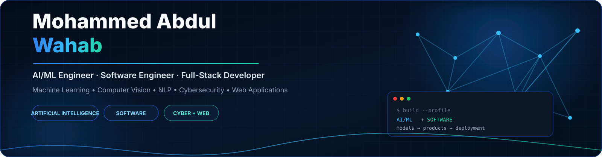
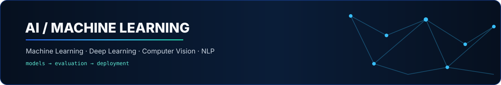
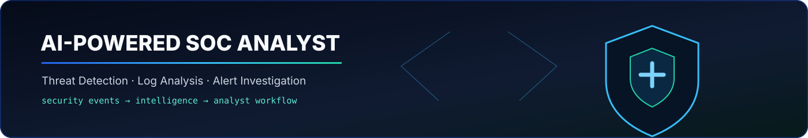

<div align="center">

# ⚡ MOHAMMED ABDUL WAHAB

### AI/ML Engineer · Software Engineer · Full-Stack Developer

**Building intelligent systems, machine learning applications, and modern web experiences.**

<br>

[](https://github.com/Abdul-Wahab-75)
[](https://github.com/Abdul-Wahab-75?tab=followers)
[](https://github.com/Abdul-Wahab-75)
[](https://www.linkedin.com/in/mohammed-abdul-wahab07)

</div>

---

<div align="center">

## `01` — ABOUT ME

</div>

I'm a **Computer Science Engineering student** focused on:

`Artificial Intelligence` · `Machine Learning` · `Computer Vision` · `Software Engineering`

I enjoy turning ideas into practical products — from developing machine learning models and computer-vision applications to building full-stack web applications.

Currently focused on strengthening my engineering fundamentals, building real-world projects, and preparing for **AI/ML and Software Engineering internships**.

---

<div align="center">

## `02` — WHAT I BUILD

</div>

<table>
<tr>
<td width="50%" valign="top">

### 🤖 ARTIFICIAL INTELLIGENCE

- Machine Learning
- Deep Learning
- Computer Vision
- Image Classification
- Natural Language Processing
- Data Analysis
- AI-powered Applications

</td>

<td width="50%" valign="top">

### 💻 SOFTWARE ENGINEERING

- Full-Stack Applications
- REST APIs
- Frontend Development
- Backend Development
- Database Integration
- Application Architecture
- Deployment

</td>
</tr>
</table>

---

<div align="center">

## `03` — FEATURED PROJECTS

</div>

### 🌿 Plant Disease Classification

**Computer Vision · Deep Learning · Python**

A deep learning application that analyzes plant leaf images and classifies potential plant diseases.

**Technology Stack**


<br>

[](https://github.com/Abdul-Wahab-75/Plant-Disease-Classification)

---

### 🛡️ AI-Powered SOC Analyst Platform

**Artificial Intelligence · Cybersecurity · Machine Learning**

An AI-powered Security Operations Center platform designed to assist security analysts with:

- Threat detection
- Log analysis
- Alert investigation
- Security-event analysis
- AI-assisted security workflows

The goal is to use AI to reduce repetitive SOC tasks and help analysts investigate potential security threats more efficiently.

**Technology Stack**


**Status:** `UNDER DEVELOPMENT`

---

### 🌐 Full-Stack Web Applications

**Frontend · Backend · APIs**

Building responsive web applications with modern interfaces, backend services, API integration, and database functionality.

**Technology Stack**


---

<div align="center">

## `04` — TECHNICAL SKILLS

</div>

### Programming Languages

<div align="center">


</div>

### AI / Machine Learning

<div align="center">


</div>

### Web Development

<div align="center">


</div>

### Developer Tools

<div align="center">


</div>

---

<div align="center">

## `05` — CURRENT FOCUS

</div>

<table>
<tr>
<td width="33%" align="center">

### 🤖 AI / ML

Machine Learning  
Deep Learning  
Computer Vision  
NLP  
Model Development

</td>

<td width="33%" align="center">

### ⚙️ ENGINEERING

Data Structures  
Algorithms  
OOP  
Clean Code  
Software Design

</td>

<td width="33%" align="center">

### 🌐 DEVELOPMENT

Full-Stack  
REST APIs  
Databases  
Deployment  
AI Applications

</td>
</tr>
</table>

---
## `06` — LEARNING ROADMAP

```text
Python
   │
   ▼
Data Structures & Algorithms
   │
   ▼
Data Science & Statistics
   │
   ▼
Machine Learning
   │
   ▼
Deep Learning
   │
   ├──────────────► Computer Vision
   │
   ├──────────────► NLP
   │
   ▼
AI Engineering
   │
   ▼
Production & Deployment
```

<br>

<div align="center">



</div>

<br>

<div align="center">



</div>

<br>

<div align="center">



</div>

<br>

<div align="center">


</div>
